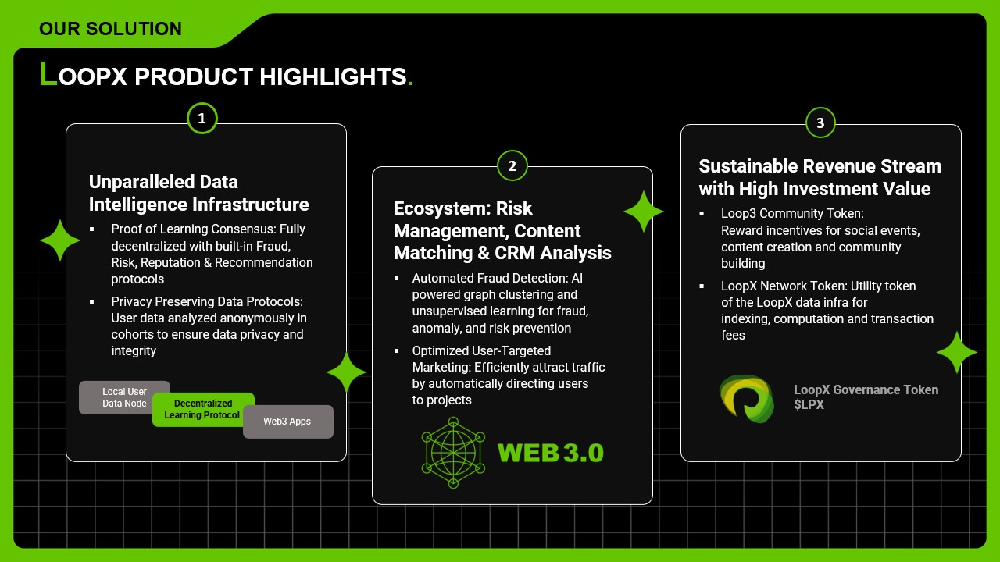

# 🏆 Democratize AI Onchain

<figure><figcaption></figcaption></figure>

## Web3 Data Intelligence is Missing

Today’s blockchain world is dominated by smart contract solution with proof of stake for scalability. Yet, the smart contract is limited to very simple operations and in lack of decentralized data support.

LoopX Network is a decentralized Web3 data intelligence infrastructure in which users can plug in their local data together with public onchain and offchain data. More enriched decentralized applications and secure multichain Web3 ecosystem can be built on top of it. User behaviors, wallet profiles and protocol forensics are learned and propagated in the network in a privacy preserving manner to empower data driven DApps and build digital asset security and risk management.

## LoopX Fills This Gap

LoopX builds the fundamental Web3 data intelligence layer for onchain security, digital asset management, next generation social networking, targeted user growth, decentralized Web3 content distribution, identity, reputation, personalized recommendation and fully decentralized data ownership. Data ownership is given back to users, while data analytics and intelligence capacities are maintained by LoopX Network in a fully decentralized manner. The learned behaviors are accessible through smart contracts in LoopX network or any other blockchain in privacy preserving manner.

## A Censorship Resistant Future for Data Applications

LoopX AI network is to provide censorship resistance, public access and ownership for the AI development. It is a hardware coordination layer for compute resources and data intelligence layer for AI development coordination.

<figure><figcaption></figcaption></figure>
