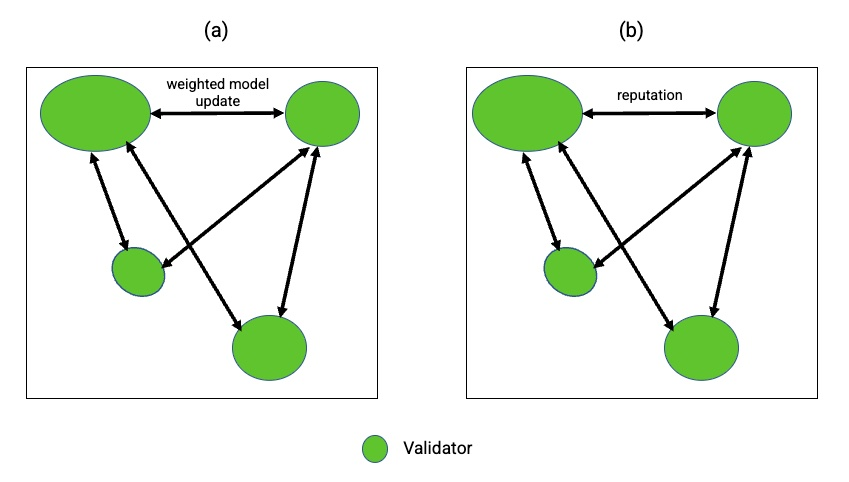

# Network Participants

<figure><figcaption>
Each validators earn a reputation in serving DApp requests and AI model training.
</figcaption></figure>

## Data Owners, Validators & DApps

Data owners, network validators and DApps are major market participants. Data owners contribute data to the network in a privacy preserving manner. To preserve local data privacy, encryption methods and privacy preserving AI approaches are adopted to learn local AI models. Validators reach consensus with proof of learning. DApps consume the AI model predictions and form the network demand.
