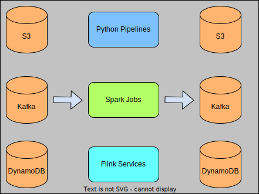

# 🔊 Analytics Publisher

<figure><figcaption>
Aggregation solution overview. Batch jobs include but not limited to Python and Spark jobs. Commonly used data stores are S3, Kafka, MySQL and DynamoDB.
</figcaption></figure>

## Data Types

The data sources for publishers can be:

* aggregated data with aggregation windows of seconds to months,
* learned prediction results from local AI models such on-device AI solutions, and
* embedding vectors and cohorts from privacy and local models.

The above data are the inputs of the AI models in the LoopX Network.

## Aggregation Queries

The aggregation queries can vary from:

* batch SQL like queries by aggregating data with a large time duration,
* streaming and realtime queries with sub-seconds, seconds, minutes and realtime aggregation windows and
* even machine learning models for local PID data preprocessing.

The queries are arbitrary and config driven development for public usages.

## Computation Frameworks

Commonly used frameworks are:

* batch Spark jobs,
* offline Python pipelines and
* streaming jobs with Spark streaming, Kinesis and Flink.

The above pipelines and jobs are typically scheduled periodically or online with solutions like Airflow, Kubernetes and so on.
