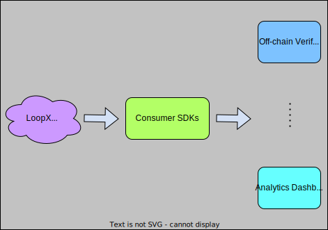

# 🚚 Client Consumer

<figure><figcaption>
Client consumer SDKs are utility tools for off-chain applications. Typical applications include but not limited to data verifications and analytics dashboard.
</figcaption></figure>

The client consumers are services and SDKs to fetch on-chain AI predictions. The data is downloaded off-chain for analytics, dashboards and network verifications. The APIs are customized with:

* AI model configs such as model id, model name, model description and so on,
* predefined on-chain with flexible queries and model types, and
* SDKs in common programming languages for analytics, verifications etc.

Client consumers are the interfaces with off-chain applications as a result.
