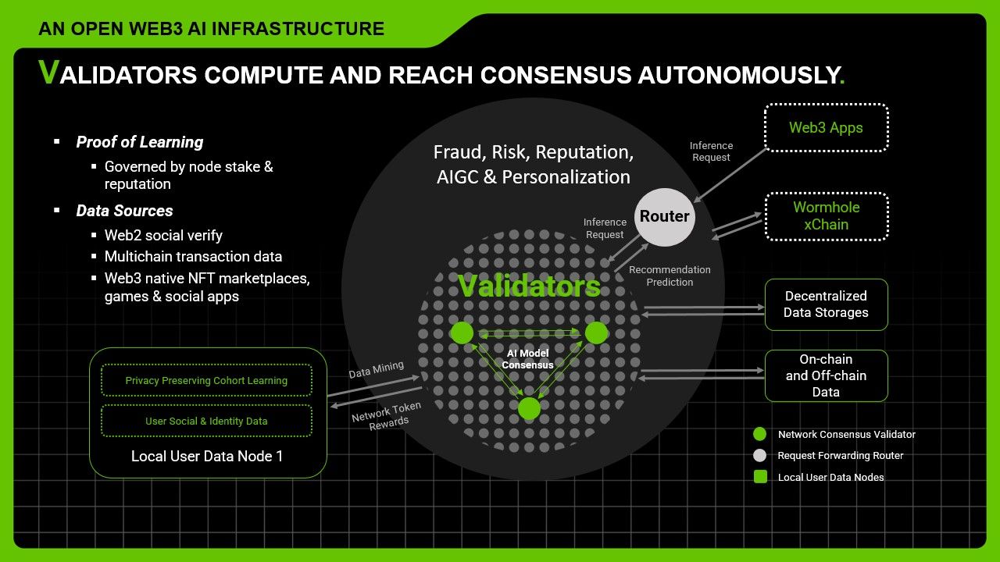

# ⛏ Proof of Learning

<figure><figcaption></figcaption></figure>

### High-Level PoL Design Overview

Validators collectively manage the AI model consensus and predictions in a decentralized manner. The model types are generic and various applications are supported to enable the next generation data driven DApps such as SocialFi, safer DeFi & wallets, GameFi etc. With fully verified onchain data analytics and intelligence, LoopX transforms fragmented Web2 and Web3 data into one composable data intelligence layer​.

The network is secured by Proof of Learning (PoL) mechanism as detailed below. The network validators reach consensus for AI model inference and training.

* Two thirds of the validators are required for consensus.
* At any given time, there is a set of live validators (minimum 21 online).
* Each validator is responsible for both model maintenance and inference.

