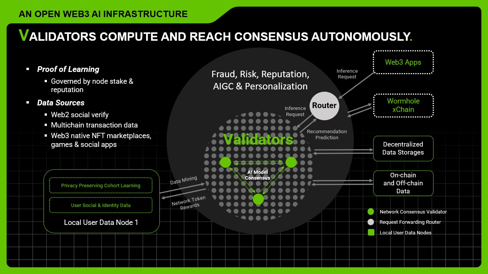

# Proof of Learning

<figure><figcaption>
(a) A centralized learning framework. (b) A partially decentralized learning framework. (c) A fully decentralized learning framework.
</figcaption></figure>

## Validator Discovery

Validators keep in sync for AI model repositories, model architecture, and embeddings in a P2P substrate network. They discover and communicate with each other by gossip protocols. All the data are indexed and searchable via distributed hash table (DHT). Each validator maintains a list of other validators as neighbors.

## Large Model Handling

The model sizes are huge in today's large-scale AI implementations. As a result, each model is chunked into smaller pieces and buffer maps store the model chunks available in neighbors. Buffer maps are exchanged in the overlay network to recover the entire model file for predictions.

The network is powered by Tensorflow AI framework so that validators can leverage the publicly acceptable APIs. Meanwhile, the validator software is upgradable.

## Learning Algorithms

The key idea behind protecting user data ownership and privacy is to adopt a fully decentralized learning method like gossip learning. In fully decentralized learning, the whole learning is coordinated by the local nodes without a central server orchestrating it.

<figure><figcaption></figcaption></figure>

Our decentralized learning is based on the gossip learning. The users propagate their data and/or model parameters as described in Alg. 2, and the validators take the role of model learning as shown in Alg. 3.

<figure><figcaption></figcaption></figure>

<figure><figcaption></figcaption></figure>

## Network Robustness

The network robustness comes from the fact that the nodes with bad behaviors such as tampering data and forging model updates and/or inference can be penalized by taking away their stakes, making them suffer economically. To be extra safe, reputation scores, which reflect validators’ data storage, model performance metrics, and past interactions with other nodes in the network, will be considered in the weighted voting.

<figure><figcaption></figcaption></figure>

### High-Level PoL Design Overview

Validators collectively manage the AI model consensus and predictions in a decentralized manner. The model types are generic and various applications are supported to enable the next generation data driven DApps such as SocialFi, safer DeFi & wallets, GameFi etc. With fully verified onchain data analytics and intelligence, LoopX transforms fragmented Web2 and Web3 data into one composable data intelligence layer​.

The network is secured by Proof of Learning (PoL) mechanism as detailed below. The network validators reach consensus for AI model inference and training.

* Two thirds of the validators are required for consensus.
* At any given time, there is a set of live validators (minimum 21 online).
* Each validator is responsible for both model maintenance and inference.

### High-Level PoL Design Overview

Validators collectively manage the AI model consensus and predictions in a decentralized manner. The model types are generic and various applications are supported to enable the next generation data driven DApps such as SocialFi, safer DeFi & wallets, GameFi etc. With fully verified onchain data analytics and intelligence, LoopX transforms fragmented Web2 and Web3 data into one composable data intelligence layer​.

The network is secured by Proof of Learning (PoL) mechanism as detailed below. The network validators reach consensus for AI model inference and training.

* Two thirds of the validators are required for consensus.
* At any given time, there is a set of live validators (minimum 21 online).
* Each validator is responsible for both model maintenance and inference.

